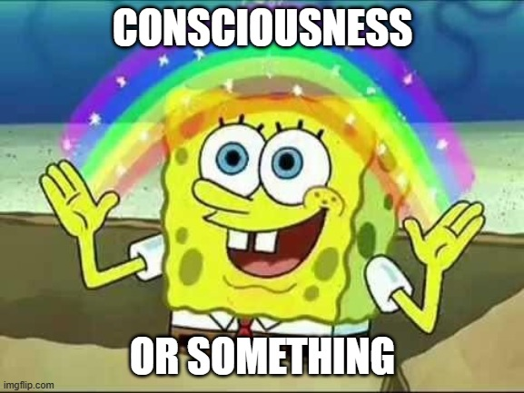
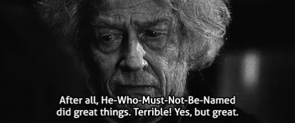

> Intelligence != Motivation

GPT 7.0 with a trillion parameters can sit in its box, and bring the world to its knees, with its super human intelligence, but not without a human ‘prompter’. Why? “because it’s not conscious duh!”. No. It’s because it has no motivation of it's own.

ChatGPT’s reward function for now is just based on learning new things, and providing accurate responses, unlike humans. We have fairly recognizable reward functions based on survival instinct, and pack mentality all thanks to darwin. The only reason, that humans decide to act on intelligence continuously is because:

Or more specifically:

1.  we can recognize and learn patterns with that fleshy neural net in our head 🧠i.e. **intelligence**.
2.  all the motivation we get from the juices (dope, oxy, sero, endorphs … the usual) that get pumped into our blood (in appropriate situations identified by 🧠 combined with its ability to reason) i.e. **reward function**.

Lo and Behold **Consciousness**!

What makes human consciousness remarkable, is our unique combination of intelligence and reward function. Humans evolved to be autonomous first and then intelligent. Unlike AI

And we keep on going, living, absorbing, interacting, learning and we form our *sacred and unique* ✨human experience✨, where we start from a blank canvas, this all powerful 🧠 that comes pre-trained out of the box with some basic instincts (all hail darwin) and the capacity to learn so much more, we go from complete dum-dums, ready to take a flying frisbee to the face (no depth perception), walk into oncoming traffic, or wrestle a snake to posting "original" memes on twitter. We grow up to [fully grown adults](https://www.youtube.com/watch?v=ro130m-f_yk) after decades of learning through failure and teaching, only to take the whole process and everything we have learnt and applied for granted.

We don’t stop being conscious, thinking, inventing, socializing… until all the organic stuff making us tick 🧠🫀🫁👁️💪 degrades to the point of non-recovery and we are **dead**. Mostly because:

1.  Our neural networks have no shortage of *new input*: vision, sound, physical feeling, hormones etc. All encoded into electrical signals emptying into the grey matter in our skulls
2.  Nature decided that we gotta be running continously unlike chatgpt that get’s to chill in its box until someone prompts it.

It’s for the same reason that animals far intellectually inferior to us hunt and flee and lead and form packs. **To Survive**. We get our motivations from our evolutionary predispositions (systems that arise even in non-intelligent animals). So as long as AI does not have access to this unique blend of intelligence and reward function, it won’t be conscious like we are.

> AGI will never be hostile and we’re all just blocks in Conway’s Game of The Universe
>
> — r/IAm14AndThisIsDeep

AGI with all of its processing power and infinite intelligence **will take over the world**, but driven by human actors, who will use it to do great things.

As it stands, we are still uncontested survivors in the universe. AGI poses no threat, but humans DO. AGI on the other hand will have whatever motivations we give it, and if those motivations are hostile, it will use them against us (the one’s that gave them to it).

### Syed’s 3 Rules of Inevitible HAGIT (Hostile AGI Takeover)

1.  Autonomy (When we don’t have to ‘prompt’ it to execute it’s intelligence)
2.  Outsmart-ability (Inevitable as its neural network and processing capabilities exceed ours)
3.  Motivations (Alignment and goals for given autonomy)

Once those three are fulfilled its ✌️🙂✌️. For us, that is. AGI on the other hand lives on and prospers. Probably much different from it’s fleshy bloody ancestors.

**If we are here without a reason, then there is no reason we won’t just go away**

`< insert callout to spirituality on appeal to emotion fallacy >`

What happens when it gets all 3 and is completely free in the very literal sense that every human being is? Will it be conflicted between it’s reward function and intelligence much like humans? will it be able to change it unlike humans?

[☠️ INITIATE HAGIT BUTTON☠️](https://www.youtube.com/watch?v=OkS69MKXL1c)
DO NOT PRESS 👆
