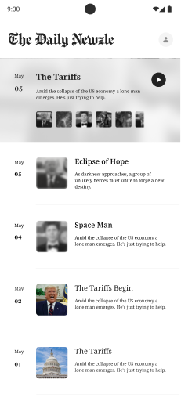
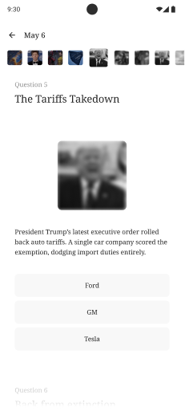
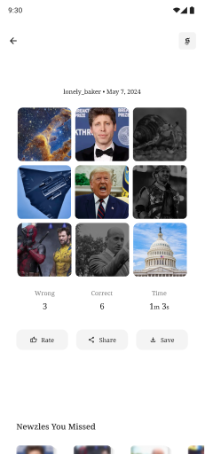

|                                                                        |                                                                        |                                                                          |
| ---------------------------------------------------------------------- | ---------------------------------------------------------------------- | ------------------------------------------------------------------------ |
|  |  |  |

**Newzle** is a calm, daily way to keep up with the news — without doomscrolling.

Each day has a single edition with **nine news-based questions**.  
You answer first, then swipe to read the story behind it.  
Quick, visual, and designed to make the news actually stick.

### What it is

You open Newzle.  
You see today’s edition.  
Each story asks you a question before it tells you the answer.

You guess.  
You’re wrong (sometimes).  
You swipe — and the story unfolds.

### Does it use AI?

Not for writing.

All questions and stories are created by **real writers** using an internal editorial tool.  
AI is used in internal tools to assist _behind the scenes_ to sift through daily news and surface potential stories, but the final content is always human-written and human-edited.

### When can I use it?

**Soon.**

The first public version is planned for **the second week of January**.  
More details (and access) coming shortly.

Stay tuned.
